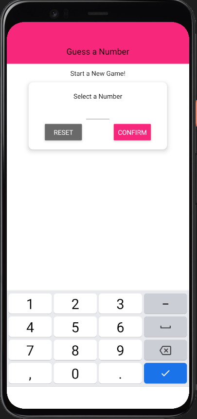
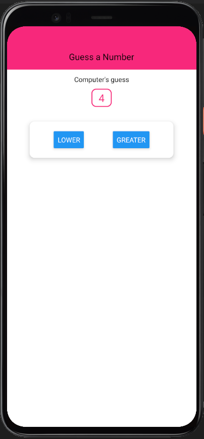

**Coding a React-Native GuessNumber App through Expo platform**

 

> Using React-Native components like TouchableWithoutFeedback, Keyboard or Alert
>
> Creating variables for repetitive used colors
>
> Testing mobile rendering on Virtual Android device

 

Thx to [Academind Tuto](https://www.youtube.com/watch?v=qSRrxpdMpVc) 😉

 

